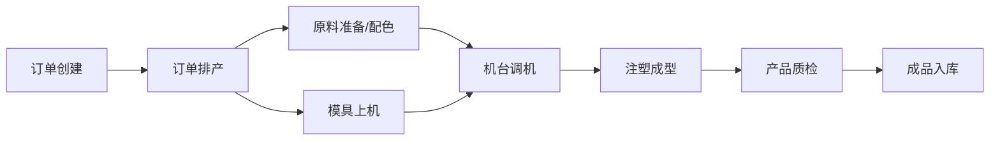

## 1. 产品概述

注塑车间塑料制品业务管理后台，用于注塑厂管理机台、模具和成型全流程。系统覆盖订单排产、原料配色、机台调机、注塑成型、产品质检、模具上下、能耗统计七大核心模块，帮助注塑企业实现生产数字化管理。

- **目标用户**：注塑车间管理人员、生产调度员、质检员、设备维护人员
- **产品价值**：提升生产效率，降低能耗损耗，规范质量管理，实现数据化决策

## 2. 核心功能

### 2.1 用户角色

| 角色 | 登录方式 | 核心权限 |
|------|----------|----------|
| 管理员 | 账号密码登录 | 全部模块管理、数据统计、系统配置 |
| 生产调度 | 账号密码登录 | 订单排产、机台调度、进度查看 |
| 质检人员 | 账号密码登录 | 产品质检、尺寸抽检、质量记录 |
| 设备维护 | 账号密码登录 | 模具上下机、调机参数、设备维护 |

### 2.2 功能模块

1. **订单排产**：注塑订单列表、排产计划、生产进度跟踪
2. **原料配色**：塑料原料烘干记录、色母配色比例管理
3. **机台调机**：注塑机调机参数、保压时间设定、模温机温度控制
4. **注塑成型**：成型周期记录、生产数据采集、实时监控
5. **产品质检**：缩水飞边检查、尺寸抽检记录、质量报告
6. **模具上下**：模具上下机记录、模具状态管理、使用寿命追踪
7. **能耗统计**：注塑机能耗数据、能耗分析、成本核算

### 2.3 页面详情

| 页面名称 | 模块名称 | 功能描述 |
|----------|----------|----------|
| 仪表盘 | 数据概览 | 关键指标卡片、今日产量、设备状态、能耗概览 |
| 订单排产 | 订单管理 | 订单列表、新增订单、排产计划、进度甘特图 |
| 原料配色 | 原料管理 | 原料库存、烘干记录、色母配方、配色比例 |
| 机台调机 | 调机管理 | 机台列表、调机参数、保压时间、模温设定 |
| 注塑成型 | 成型管理 | 成型周期、生产记录、实时状态、产量统计 |
| 产品质检 | 质量管理 | 外观检查、尺寸抽检、缺陷记录、质检报告 |
| 模具管理 | 模具上下 | 模具台账、上下机记录、状态监控、寿命管理 |
| 能耗统计 | 能耗分析 | 能耗数据、趋势图表、成本分析、对比报表 |

## 3. 核心流程

### 3.1 生产主流程

订单创建 → 订单排产 → 原料准备/配色 → 模具上机 → 机台调机 → 注塑成型 → 产品质检 → 成品入库

### 3.2 质检流程

成型产品 → 外观检查（缩水飞边） → 尺寸抽检 → 合格判定 → 合格入库/不合格处理

## 4. 用户界面设计

### 4.1 设计风格

- **主色调**：工业蓝（#1e40af）作为主色，搭配橙色（#f97316）作为强调色
- **辅助色**：绿色（#10b981）表示正常/合格，红色（#ef4444）表示异常/不合格
- **中性色**：深灰（#1f2937）背景，中灰（#6b7280）文字，浅灰（#f3f4f6）卡片背景
- **整体风格**：工业科技风，简洁专业，数据可视化突出
- **按钮样式**：圆角矩形，hover时有阴影和微缩放效果
- **字体**：系统无衬线字体，标题加粗，数据等宽字体
- **布局风格**：左侧导航栏 + 顶部工具栏 + 主内容区，卡片式布局
- **图标风格**：线性图标，统一24px尺寸

### 4.2 页面设计概览

| 页面名称 | 模块名称 | UI元素 |
|----------|----------|--------|
| 仪表盘 | 数据概览 | 统计卡片网格、趋势折线图、设备状态列表、环形进度图 |
| 订单排产 | 订单管理 | 筛选工具栏、订单表格、排产甘特图、进度状态标签 |
| 原料配色 | 原料管理 | 原料库存卡片、烘干记录表、配色配方表、比例柱状图 |
| 机台调机 | 调机管理 | 机台状态卡片、参数表单、温度曲线图、保压时间表 |
| 注塑成型 | 成型管理 | 周期记录表、实时状态面板、产量柱状图、运行状态灯 |
| 产品质检 | 质量管理 | 质检表单、尺寸记录表、缺陷分布图、合格率统计 |
| 模具管理 | 模具上下 | 模具台账卡片、上下机记录、状态时间轴、寿命进度条 |
| 能耗统计 | 能耗分析 | 能耗折线图、对比柱状图、成本统计卡、设备能耗排名 |

### 4.3 响应式

- 桌面端优先设计，主内容区最小宽度1200px
- 平板端侧边栏可折叠
- 支持1440p及以上大屏适配，保持良好的留白和可读性

### 4.4 数据可视化

- 使用图表库展示生产趋势、能耗分析、质量统计
- 仪表盘采用卡片网格布局，关键指标突出显示
- 状态指示器使用颜色编码，一目了然
