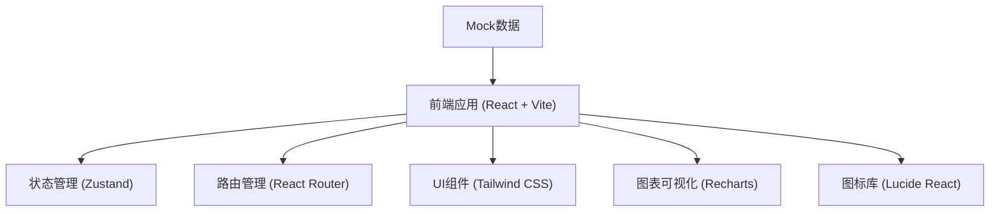

## 1. 架构设计



## 2. 技术描述

- **前端框架**：React@18 + TypeScript
- **构建工具**：Vite@5
- **路由管理**：react-router-dom@6
- **状态管理**：zustand@4
- **UI样式**：tailwindcss@3
- **图标库**：lucide-react@0.294
- **图表库**：recharts@2
- **数据**：前端Mock数据，无后端服务

## 3. 路由定义

| 路由 | 页面 | 功能 |
|------|------|------|
| / | 仪表盘 | 数据概览、关键指标 |
| /orders | 订单排产 | 订单管理、排产计划 |
| /material | 原料配色 | 原料管理、配色配方 |
| /machine | 机台调机 | 调机参数、模温控制 |
| /molding | 注塑成型 | 成型周期、生产记录 |
| /quality | 产品质检 | 质量检查、抽检记录 |
| /mold | 模具管理 | 模具上下、状态管理 |
| /energy | 能耗统计 | 能耗分析、成本统计 |

## 4. 数据模型

### 4.1 数据模型定义

```mermaid
erDiagram
    ORDER ||--o{ PRODUCTION_ORDER : has
    MATERIAL ||--o{ COLOR_FORMULA : has
    MACHINE ||--o{ MACHINE_PARAM : has
    MOLD ||--o{ MOLD_RECORD : has
    PRODUCTION_ORDER ||--o{ MOLDING_CYCLE : produces
    MOLDING_CYCLE ||--o{ QUALITY_CHECK : has
    MACHINE ||--o{ ENERGY_RECORD : consumes

    ORDER {
        string id
        string orderNo
        string productName
        int quantity
        string status
        date deliveryDate
        string machineId
        string moldId
    }

    MATERIAL {
        string id
        string materialName
        string materialType
        float stock
        string unit
    }

    COLOR_FORMULA {
        string id
        string formulaName
        string baseMaterial
        float colorMasterRatio
        float additiveRatio
        string colorCode
    }

    MACHINE {
        string id
        string machineNo
        string machineType
        int tonnage
        string status
        float currentTemperature
    }

    MACHINE_PARAM {
        string id
        string machineId
        float injectionPressure
        float holdingPressure
        float holdingTime
        float moldTemperature
        float barrelTemperature
        float cycleTime
    }

    MOLD {
        string id
        string moldNo
        string moldName
        int cavities
        int totalShots
        int maxShots
        string status
    }

    MOLDING_CYCLE {
        string id
        string orderId
        string machineId
        datetime startTime
        datetime endTime
        int shotCount
        float cycleTime
    }

    QUALITY_CHECK {
        string id
        string cycleId
        bool shrinkage
        bool flash
        float dimensionLength
        float dimensionWidth
        float dimensionHeight
        string result
    }

    ENERGY_RECORD {
        string id
        string machineId
        date date
        float powerConsumption
        float runtime
    }
```



### 4.2 核心类型定义

```typescript
// 订单
interface Order {
  id: string;
  orderNo: string;
  productName: string;
  quantity: number;
  completedQuantity: number;
  status: 'pending' | 'scheduled' | 'producing' | 'completed';
  deliveryDate: string;
  machineId: string;
  moldId: string;
  material: string;
}

// 原料
interface Material {
  id: string;
  materialName: string;
  materialType: string;
  stock: number;
  unit: string;
  dryingTime?: number;
  dryingTemperature?: number;
}

// 配色配方
interface ColorFormula {
  id: string;
  formulaName: string;
  baseMaterial: string;
  colorMasterRatio: number;
  additiveRatio: number;
  colorCode: string;
}

// 机台
interface Machine {
  id: string;
  machineNo: string;
  machineType: string;
  tonnage: number;
  status: 'running' | 'idle' | 'maintenance' | 'offline';
  currentTemperature: number;
}

// 调机参数
interface MachineParam {
  id: string;
  machineId: string;
  injectionPressure: number;
  holdingPressure: number;
  holdingTime: number;
  moldTemperature: number;
  barrelTemperature: number;
  cycleTime: number;
}

// 模具
interface Mold {
  id: string;
  moldNo: string;
  moldName: string;
  cavities: number;
  totalShots: number;
  maxShots: number;
  status: 'on-machine' | 'off-machine' | 'maintenance';
  currentMachine?: string;
}

// 成型周期
interface MoldingCycle {
  id: string;
  orderId: string;
  machineId: string;
  startTime: string;
  endTime?: string;
  shotCount: number;
  cycleTime: number;
  status: 'running' | 'completed';
}

// 质检记录
interface QualityCheck {
  id: string;
  cycleId: string;
  shrinkage: boolean;
  flash: boolean;
  dimensionLength: number;
  dimensionWidth: number;
  dimensionHeight: number;
  result: 'pass' | 'fail';
  inspector: string;
  checkTime: string;
}

// 能耗记录
interface EnergyRecord {
  id: string;
  machineId: string;
  date: string;
  powerConsumption: number;
  runtime: number;
  unitCost: number;
}
```

## 5. 项目结构

```
src/
├── components/          # 公共组件
│   ├── Layout/         # 布局组件
│   ├── StatusBadge/    # 状态标签
│   ├── StatCard/       # 统计卡片
│   └── DataTable/      # 数据表格
├── pages/              # 页面组件
│   ├── Dashboard/      # 仪表盘
│   ├── Orders/         # 订单排产
│   ├── Material/       # 原料配色
│   ├── Machine/        # 机台调机
│   ├── Molding/        # 注塑成型
│   ├── Quality/        # 产品质检
│   ├── Mold/           # 模具管理
│   └── Energy/         # 能耗统计
├── store/              # 状态管理
├── data/               # Mock数据
├── types/              # 类型定义
├── utils/              # 工具函数
├── App.tsx
├── main.tsx
└── index.css
```
